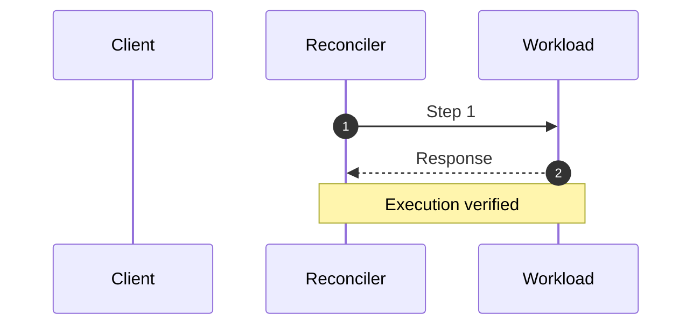
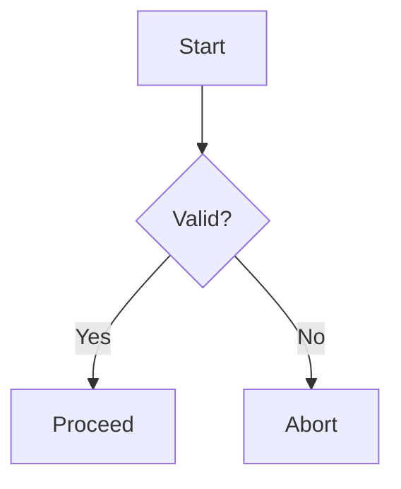

# Diagram Visualizer Skill

Use this skill when constructing visualizations for terminal output using `agent-diagram`.

## Sequence Diagrams

```mermaid
sequenceDiagram
    autonumber
    participant Client
    participant Reconciler
    participant Workload
    Reconciler->>Workload: Step 1
    Workload-->>Reconciler: Response
    Note over Reconciler,Workload: Execution verified
```

## Flowcharts

```mermaid
flowchart TD
    A[Start] --> B{Valid?}
    B -->|Yes| C[Proceed]
    B -->|No| D[Abort]
```
